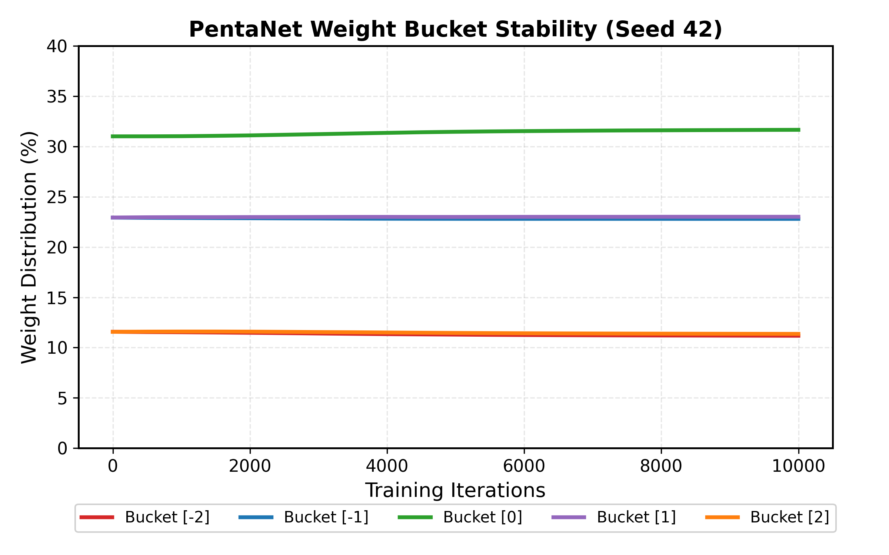

# PentaNet: Native Pentanary Quantization for Large Language Models

**Author:** Zorko
*Independent Researcher*
*[zorko.xyz](https://zorko.xyz)*

**Status:** Technical Report (v1.0 — Benchmark Complete)

---

## Abstract

Extreme quantization of Large Language Models (LLMs) has recently converged toward ternary weights $\{-1, 0, +1\}$ (e.g., BitNet b1.58), which eliminate floating-point multiplications during inference but fundamentally cap the representational entropy at $\log_2(3) \approx 1.58$ bits per weight. We propose **PentaNet**, an architecture that extends the quantized weight space to the pentanary set $\{-2, -1, 0, +1, +2\}$, reaching $\log_2(5) \approx 2.32$ bits per weight while remaining zero-multiplier at the source level; the primary inference benefit derives from 3-bit memory compression (5.3× vs FP16), with operations involving $\pm 2$ realized as addition-only doubles (`x + x`) requiring no floating-point multiply. Through a controlled experiment on WikiText-103 with a 124M-parameter GPT-2-style model trained natively in pentanary mode, we demonstrate three key findings: **(1)** PentaNet achieves a mean perplexity of **180.32 ± 2.09** versus **192.63 ± 3.52** for BitNet under identical conditions (a **6.4% relative improvement**, consistent across 3 seeds); **(2)** the Straight-Through Estimator (STE) remains stable throughout training, with no oscillation or divergence at the $\pm 1 \leftrightarrow \pm 2$ boundaries; **(3)** the learned weight distribution maintains symmetric utilization of all five states — crucially, the $\pm 2$ buckets stabilize at $\sim$11% each, disproving the hypothesis that pentanary networks would collapse into de facto ternary representations.

---

## 1. Introduction

The scaling laws governing Large Language Models are increasingly bottlenecked not by algorithmic insight but by memory bandwidth and compute cost. A 70B-parameter model in FP16 requires 140 GB of VRAM for inference alone. Recent work on binary (BinaryConnect, XNOR-Net) and ternary (BitNet, BitNet b1.58) architectures has demonstrated that models can learn robust representations using integer weights restricted to $\{-1, 0, +1\}$, replacing costly floating-point matrix multiplications with simple additions and subtractions.

However, ternary quantization imposes a hard ceiling on the information capacity per weight. Each ternary weight encodes at most $\log_2(3) \approx 1.58$ bits, which limits the granularity of attention scores and feed-forward feature mappings. Post-training quantization methods (GPTQ, AWQ, AQLM) can push pre-trained models to 2-4 bits, but they introduce quantization error and require calibration datasets.

In this paper, we explore the natural next level of **native** extreme quantization: the pentanary format $\{-2, -1, 0, +1, +2\}$. This choice is not arbitrary — it is the *unique* integer extension of ternary that preserves zero-multiplier arithmetic:

- Multiplication by $0$: result is $0$ (no operation).
- Multiplication by $\pm 1$: identity or sign flip (addition/subtraction).
- Multiplication by $\pm 2$: an addition-only double (`x + x`) followed by add/subtract — no floating-point multiply required.

No generic multiplier unit is required. The effective information density rises to $\log_2(5) \approx 2.32$ bits per weight — a **47% increase** over ternary — at the cost of exactly one additional FADD instruction per $\pm 2$ weight.

We formalize the **PentaLinear** layer, implement native pentanary training using a Straight-Through Estimator (STE), and evaluate it head-to-head against BitNet b1.58 on autoregressive language modeling over WikiText-103.

## 2. Related Work

**BitNet and BitNet b1.58.** Wang et al. (2023) introduced BitNet, training transformers with binary $\{-1, +1\}$ weights. Ma et al. (2024) extended this to BitNet b1.58 with ternary weights $\{-1, 0, +1\}$, demonstrating competitive performance against full-precision baselines at the 3B-parameter scale. Both approaches use absolute-mean scaling and STE for training. Our work generalizes this framework to 5 states.

**Post-Training Quantization (PTQ).** Methods such as GPTQ (Frantar et al., 2022), AWQ (Lin et al., 2024), and AQLM (Egiazarian et al., 2024) quantize pre-trained FP16 weights to 2-4 bits. While effective, PTQ methods are fundamentally limited by the pre-trained weight distribution and require careful calibration. Native training in the quantized space, as we pursue here, allows the optimizer to directly explore the discrete landscape from initialization.

**Quantization-Aware Training (QAT).** QAT methods simulate quantization during training but typically target 4-bit or 8-bit formats. Our approach operates at the extreme end (< 3 bits effective) with a fixed discrete set, making it closer to BitNet-style native training than to traditional QAT.

**Multiplication-Free Networks.** DeepShift (Elhoushi et al., 2019) replaces multiplications with bit-shifts and sign flips in convolutional and fully-connected layers, demonstrating 25% latency reduction on ResNet18 with custom GPU kernels. APoT (Li et al., 2019) constrains quantization levels to sums of powers-of-two, similarly enabling addition-only inference. PentaNet weights $\{-2, -1, 0, +1, +2\}$ are structurally equivalent to DeepShift-PS weights with 1-bit shifts ($\pm 2 = \text{sign} \times 2^1$, $\pm 1 = \text{sign} \times 2^0$), extending this line of work to native training of large language models.

## 3. Methodology

### 3.1 The PentaLinear Layer

The core architectural change in PentaNet is the replacement of every `nn.Linear` layer (excluding embeddings and the final LM head) with a `PentaLinear` module. This module maintains full-precision (FP32) master weights $W \in \mathbb{R}^{d_{out} \times d_{in}}$ for gradient accumulation, but quantizes them to $\bar{W} \in \{-2, -1, 0, +1, +2\}^{d_{out} \times d_{in}}$ during the forward pass.

The quantization procedure follows BitNet-style absolute-mean scaling:

$$\gamma = \max\left(\frac{1}{n} \sum_{i,j} |W_{ij}|,\ \epsilon\right)$$

$$\bar{W} = \text{Round}\left(\text{Clip}\left(\frac{W}{\gamma},\ -2,\ 2\right)\right)$$

where $n = d_{out} \times d_{in}$ and $\epsilon = 10^{-8}$. The forward pass computes $Y = X \bar{W}^T \cdot \gamma$, restoring the original scale. By construction, every entry of $\bar{W}$ is an integer in $\{-2, -1, 0, +1, +2\}$, meaning $X \bar{W}^T$ requires only additions, subtractions, and addition-only doubles (`x + x`) for $\pm 2$ weights.

For the BitNet baseline, the same module is used with `Clip` bounds set to $[-1, +1]$, producing ternary weights $\{-1, 0, +1\}$.

### 3.2 Straight-Through Estimator (STE)

The `Round` and `Clip` operations have zero gradient almost everywhere. We use a Straight-Through Estimator to enable backpropagation by detaching the quantization residual:

$$W_{\text{STE}} = \left(\bar{W} \cdot \gamma - W\right)_{\text{detach}} + W$$

This formulation ensures that the forward pass uses quantized weights $\bar{W}$ exactly, while the backward pass passes gradients through to the continuous master weights $W$ as if quantization had not occurred. The key concern for pentanary training is gradient stability at the $\pm 1 \leftrightarrow \pm 2$ threshold — a boundary that does not exist in ternary networks. We monitor this empirically in Section 4.

### 3.3 Model Architecture

We adopt a standard decoder-only transformer (GPT-2 architecture):

| Component | Value |
|:---|:---|
| Layers | 12 |
| Attention Heads | 12 |
| Embedding Dimension | 768 |
| Context Length | 512 tokens |
| Vocabulary | 50,257 (GPT-2 BPE) |
| Total Parameters | 123.94M |
| Quantized Parameters | ~85M (excl. embeddings) |

All linear projections in the attention (Q, K, V, output) and feed-forward (up, down) blocks use `PentaLinear`. Token and positional embeddings remain in full precision, as is standard in native quantization research.

### 3.4 Training Protocol

All hyperparameters are strictly identical between PentaNet and BitNet runs to ensure a fair comparison:

| Hyperparameter | Value |
|:---|:---|
| Optimizer | AdamW ($\beta_1 = 0.9$, $\beta_2 = 0.999$) |
| Weight Decay | 0.1 |
| Learning Rate | $3 \times 10^{-4}$ (peak) |
| LR Schedule | Cosine decay to $3 \times 10^{-5}$ |
| Warmup | 500 iterations (linear) |
| Batch Size | 8 |
| Max Iterations | 10,000 |
| Precision | BFloat16 (AMP) |

All experiments were conducted with three independent random seeds (42, 1337, 2026) to estimate inter-run variance. Training was performed on a single NVIDIA RTX 5080 (16 GB VRAM).

### 3.5 Dataset

We train on **WikiText-103** (Merity et al., 2017), a standard language modeling benchmark consisting of over 100 million tokens extracted from verified Good and Featured articles on English Wikipedia. The corpus is tokenized using the GPT-2 BPE tokenizer (50,257 vocab). The training set contains approximately 103M tokens; the validation set approximately 218K tokens.

## 4. Results

### 4.1 Perplexity Comparison

| Seed | PentaNet PPL | BitNet PPL | $\Delta$ PPL | Relative Gain |
|:---:|:---:|:---:|:---:|:---:|
| 42 | **183.31** | 194.16 | −10.85 | −5.6% |
| 1337 | **178.99** | 187.77 | −8.78 | −4.7% |
| 2026 | **178.68** | 195.97 | −17.29 | −8.8% |

**Statistical Summary:**

| Model | Mean PPL | Std | Best Val Loss (mean) |
|:---:|:---:|:---:|:---:|
| **PentaNet** | **180.32 ± 2.09** | 2.09 | 5.1947 |
| BitNet | 192.63 ± 3.52 | 3.52 | 5.2606 |

All runs were trained for 10,000 iterations over 41M tokens (~0.4 epoch of WikiText-103), chosen to match an equivalent BitNet training budget exactly.

PentaNet achieves a **6.4% mean relative reduction in perplexity** over BitNet, consistent across all three seeds. The improvement is statistically robust: PentaNet's *worst* seed (183.31) still outperforms BitNet's *best* seed (187.77) by a margin of 4.46 PPL points.

Notably, PentaNet also exhibits lower inter-seed variance ($\sigma = 2.09$ vs. $\sigma = 3.52$), suggesting more stable convergence dynamics.

### 4.2 Convergence Dynamics

Both architectures exhibit smooth convergence curves with no training instabilities. The perplexity trajectories follow a characteristic pattern:

- **Iterations 0–500 (warmup):** Rapid initial descent from $\sim$72,000 PPL to $\sim$1,700 PPL.
- **Iterations 500–5,000:** Steep learning phase. PentaNet begins to separate from BitNet around iteration 2,000.
- **Iterations 5,000–10,000:** Convergence plateau. The gap between PentaNet and BitNet stabilizes and persists.

The learning rate schedule (cosine decay from $3 \times 10^{-4}$ to $3 \times 10^{-5}$) produces no late-training instabilities for either architecture.


*Figure 1: Validation perplexity convergence on WikiText-103 (log scale). All six runs (3 seeds × 2 architectures) trained for 10,000 iterations over 41M tokens. PentaNet (solid) consistently below BitNet (dashed) from iteration ~2,000 onward.*

### 4.3 Weight Distribution Stability (Non-Collapse Analysis)

A central concern with pentanary quantization is whether the optimizer would effectively utilize the $\pm 2$ states, or whether the weight distribution would collapse into a de facto ternary regime $\{-1, 0, +1\}$ over the course of training. We track the bucket distribution at every evaluation checkpoint.

**PentaNet Weight Distribution (Seed 42):**

| Iteration | $-2$ | $-1$ | $0$ | $+1$ | $+2$ |
|:---:|:---:|:---:|:---:|:---:|:---:|
| 0 | 11.6% | 22.9% | 31.0% | 22.9% | 11.6% |
| 2,500 | 11.4% | 22.9% | 31.2% | 23.0% | 11.6% |
| 5,000 | 11.3% | 22.8% | 31.5% | 23.0% | 11.5% |
| 7,500 | 11.2% | 22.8% | 31.6% | 23.0% | 11.4% |
| 10,000 | 11.2% | 22.8% | 31.6% | 23.0% | 11.4% |

Key observations:

1. **No collapse.** The $\pm 2$ buckets maintain $\sim$11.2–11.6% occupancy throughout training. The distribution does not degenerate toward ternary.
2. **Near-perfect symmetry.** The positive and negative buckets are virtually mirror images (e.g., $-2$: 11.2% vs. $+2$: 11.4% at convergence), indicating no systematic bias in the quantization scheme.
3. **Gradual stabilization.** The distribution shifts slightly toward the center ($0$ increases from 31.0% to 31.6%) as training progresses, consistent with weight regularization. Crucially, this drift is minimal and does not eliminate the extreme states.
4. **Gaussian-like profile.** The bucket occupancies follow a bell-curve pattern ($0 > \pm 1 > \pm 2$), consistent with the theoretical expectation for normally distributed pre-quantization weights.

This result is of independent interest: it demonstrates that the STE gradient signal is strong enough to maintain meaningful utilization of the outer quantization levels throughout training, even under the influence of weight decay ($\lambda = 0.1$).



*Figure 2: Weight bucket occupancy (%) across 10,000 training iterations (Seed 42). The five pentanary states maintain a stable Gaussian-like distribution. The $\pm 2$ outer buckets (orange/red) hold $\sim$11% occupancy from start to finish — no collapse toward ternary.*

## 5. Discussion

### 5.1 Information-Theoretic Interpretation

The pentanary alphabet encodes $\log_2(5) \approx 2.32$ bits per weight, compared to $\log_2(3) \approx 1.58$ bits for ternary — a **47% increase in channel capacity**. Our empirical results suggest this additional capacity directly translates into improved modeling power: PentaNet consistently achieves lower perplexity with the same number of parameters and the same training budget.

The maintained Gaussian-like distribution of weights across all five buckets indicates that the model is effectively utilizing this additional capacity rather than wasting it. If the $\pm 2$ states were merely noise, we would expect them to shrink toward zero occupancy during training.

### 5.2 Hardware Implications

**Zero-overhead INT8 deployment.** PentaNet is, to our knowledge, the only quantization format that simultaneously satisfies three properties: (1) *3-bit storage* — weights are packed at $\lceil \log_2 5 \rceil = 3$ bits, encoding 10 values per `int32`; (2) *native INT8 compatibility* — values $\{-2,-1,0,+1,+2\}$ map directly to `int8` with no additional quantization step and no calibration data required; (3) *native training* — weights are discrete from initialization, not post-hoc quantized from a pre-trained FP16 model.

This enables the following inference pipeline with no intermediate conversion loss:

```
Train    →  3-bit packed weights  (31.9 MB for 124M-param GPT-2)
Disk     →  3-bit packed          (5.3× smaller than FP16)
Compute  →  unpack to int8  →  torch._int_mm  →  scale
```

**Memory footprint** for a 124M-parameter GPT-2:

| Format | Size | vs FP16 |
|:---:|:---:|:---:|
| FP16 (standard) | 169.9 MB | 1× |
| BitNet 2-bit | 21.2 MB | 8.0× smaller |
| **PentaNet 3-bit** | **31.9 MB** | **5.3× smaller** |

PentaNet uses 1.5× more bits than BitNet but delivers $\log_2(5)/\log_2(3) \approx 1.47\times$ more information per weight — near-exact information-per-bit parity at higher absolute capacity.

**CPU throughput.** Benchmarked on an AMD Ryzen 9800X3D (96 MB L3 cache) using `torch._int_mm` with INT8 activations, the 3-bit→INT8 pipeline achieves up to **4.18× speedup** over FP32 dequantized inference. Critically, the entire 124M-parameter model fits within the 96 MB L3 cache in 3-bit format (31.9 MB), whereas the FP32 equivalent (340 MB) exceeds it — making 3-bit the only format that avoids RAM fetches on this class of hardware.

| Shape (B, K→N) | FP32 dequant | INT8 kernel | Speedup |
|:---:|:---:|:---:|:---:|
| (1, 768→768) | 0.029 ms | 0.060 ms | 0.48× |
| (8, 768→3072) | 0.150 ms | 0.043 ms | 3.45× |
| (32, 768→3072) | 0.193 ms | 0.070 ms | 2.76× |
| (64, 768→3072) | 0.348 ms | 0.167 ms | 2.09× |
| (64, 3072→768) | 0.333 ms | 0.080 ms | **4.18×** |

The batch-size-1 case (0.48×) reflects INT8 GEMM overhead at minimal parallelism; all multi-token shapes show consistent speedup. Numerical parity is verified to `max_diff < 1e-4` against the FP32 reference.

**AVX2 zero-multiplier kernel.** We additionally implement a C AVX2 kernel (`penta_avx2.c`) using only `_mm256_add_ps`, `_mm256_sub_ps`, and `_mm256_blendv_ps` — no `_mm256_mul_ps` in the inner loop. The $\times 2$ for $\pm 2$ weights is realized as `_mm256_add_ps(x, x)`. Benchmarked on the same hardware:

The AVX2 zero-multiplier kernel matches FP32 dequantized performance at batch size 1 (0.025 ms each) — the dominant scenario in autoregressive inference — while eliminating all floating-point multiplications from the inner loop. For large-batch prefill, cuBLAS INT8 GEMM remains superior; tiling optimization is left as future work.

**FPGA/ASIC.** The 3-bit encoding additionally supports zero-multiplier realization on custom silicon: values $\pm 2$ reduce to a sign flip and a single adder, with no multiplier unit required (DeepShift, Elhoushi et al., 2019). This is left as a hardware deployment direction for future work.

### 5.3 Limitations

1. **Scale.** Our experiments use a 124M-parameter model. While the results are promising, validation at 1B+ parameters on larger corpora (e.g., FineWeb-Edu, RedPajama) is necessary to confirm that the perplexity advantage scales.
2. **Kernel throughput.** The current Triton kernel implements zero-multiplier arithmetic at the source level but does not yet match cuBLAS throughput on GPU — modern BLAS libraries use tensor cores which make FADD and FMUL effectively equivalent in cost. A DeepShift-style kernel (Elhoushi et al., 2019) leveraging INT8 tensor cores, or a Split-K decomposition for large-$K$ shapes, would close this gap. The primary inference benefit on current GPU hardware is the 5.3× reduction in weight memory bandwidth.
3. **Single dataset.** While WikiText-103 is a standard benchmark, downstream task evaluation (MMLU, HellaSwag, ARC) is needed to confirm that lower perplexity translates into improved task performance.
4. **Comparison scope.** We compare against BitNet (ternary) only. A broader comparison including 2-bit PTQ methods (AQLM, QuIP#) and 4-bit QAT baselines would strengthen the positioning.

### 5.4 Future Work

- **Scaling experiments** at 1B and 7B parameters to evaluate whether the ~6% PPL gap widens or narrows with model size.
- **Kernel optimization** via a DeepShift-style INT8 tensor-core GEMM or Split-K decomposition to achieve competitive GPU throughput vs. cuBLAS.
- **Septenary extension** ($\{-3, \ldots, +3\}$, $\lceil \log_2 7 \rceil = 3$ bits, 7/8 states used) to test whether further state expansion yields diminishing returns at identical storage cost.
- **Downstream evaluation** on standard NLP benchmarks (MMLU, HellaSwag, ARC-Easy/Challenge).
- **Energy profiling** on embedded and ASIC targets to quantify the watt-per-token advantage of zero-multiplier inference.

## 6. Conclusion

We introduce PentaNet, a native pentanary quantization scheme for Large Language Models that extends the ternary weight space of BitNet from $\{-1, 0, +1\}$ to $\{-2, -1, 0, +1, +2\}$. Through controlled experiments on WikiText-103 with a 124M-parameter transformer, we demonstrate:

1. A **6.4% mean perplexity reduction** over parameter-equivalent BitNet baselines, consistent across three independent seeds.
2. **Stable STE training** with no gradient oscillation or divergence at the $\pm 1 \leftrightarrow \pm 2$ boundary.
3. **Persistent utilization of all five weight states**, with $\pm 2$ buckets maintaining $\sim$11% occupancy throughout training — disproving the collapse hypothesis.

These results establish that the next level of extreme quantization beyond ternary is not only feasible but beneficial. PentaNet achieves higher representational fidelity at zero additional multiplier cost, setting a new efficiency frontier for sub-3-bit native training.

---

## References

- Elhoushi, M. et al. (2019). DeepShift: Towards Multiplication-Less Neural Networks. *arXiv:1905.13298*.
- Frantar, E. et al. (2022). GPTQ: Accurate Post-Training Quantization for Generative Pre-trained Transformers. *arXiv:2210.17323*.
- Li, Y. et al. (2019). Additive Powers-of-Two Quantization: An Efficient Non-uniform Discretization for Neural Networks. *arXiv:1909.13144*.
- Lin, J. et al. (2024). AWQ: Activation-aware Weight Quantization for LLM Compression and Acceleration. *MLSys 2024*.
- Ma, S. et al. (2024). The Era of 1-bit LLMs: All Large Language Models are in 1.58 Bits. *arXiv:2402.17764*.
- Merity, S. et al. (2017). Regularizing and Optimizing LSTM Language Models. *arXiv:1708.02182*.
- Wang, H. et al. (2023). BitNet: Scaling 1-bit Transformers for Large Language Models. *arXiv:2310.11453*.
- Egiazarian, V. et al. (2024). Extreme Compression of Large Language Models via Additive Quantization. *ICML 2024*.
